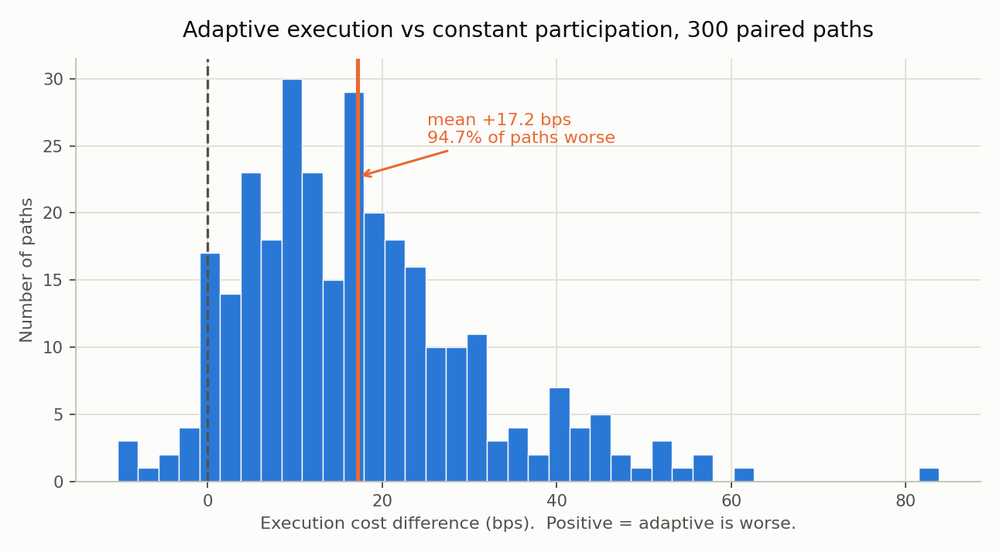
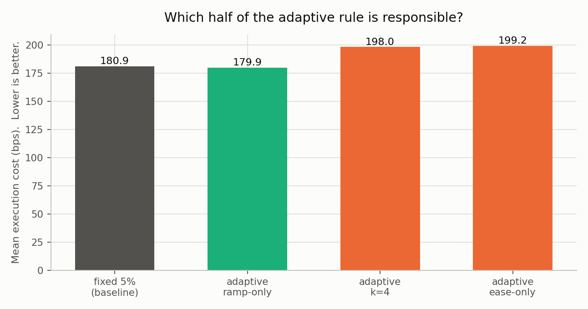

# Execution Cost Research

A backtesting engine built to answer one question: **does an "intelligent"
adaptive execution algorithm actually beat a dumb constant one?**

The answer turned out to be no — but arriving at a *trustworthy* no took four
rounds of tearing down my own measurement. That process is documented in
[`docs/FINDINGS.md`](docs/FINDINGS.md), which is the part worth reading.

## Result



An urgency-based adaptive execution rule underperforms a constant participation
rate by **17.2 bps** (95% CI [15.6, 18.7]), losing on **94.7% of 300 independent
paired paths**.

Ablation locates essentially all of the damage in one half of the rule:



The "ramp" component (speed up when the market moves against you) is roughly
neutral. The "ease" component (slow down when it moves in your favour) is the
problem: it is a large asymmetric intervention betting on momentum that this
series does not have.

## Design

The rule everything else depends on — the **strategy** decides *what position to
hold*; the **execution algorithm** decides *how fast to get there*. They meet in
exactly one line:

```python
Q = min(|target - held|, participation * volume_forecast, realism_cap)
#        └── strategy ──┘  └──── execution algorithm ────┘  └─ physics ─┘
```

Keeping those separable is what made every experiment possible: each varies one
side while holding the other fixed.

## Layout

```
src/
  data.py        synthetic OHLCV with point-in-time-safe columns
  signals.py     MA crossover, z-score reversion, ACF from the definition
  engine.py      event-driven backtest, participation caps, square-root impact
  metrics.py     implementation shortfall (and the broken version, kept on purpose)
  validation.py  walk-forward and paired Monte Carlo
experiments/
  01_order_size_vs_liquidity.py   when does the volume cap actually bind?
  02_lookahead_audit.py           biased vs point-in-time engines
  03_metric_correction.py         the equal-weighting bug, demonstrated
  04_walk_forward.py              3 folds, and why that is not enough
  05_monte_carlo.py               300 paths, paired, with ablation
  06_make_figures.py              README figures
tests/
  test_engine.py                  11 tests, several are regression guards for real bugs
```

## Running it

```bash
pip install -r ../requirements.txt
cd execution-research
python experiments/05_monte_carlo.py     # the headline result
python -m pytest tests/ -q               # or: python tests/test_engine.py
```

Everything is seeded and self-contained — no external data required, and
`test_monte_carlo_is_reproducible` enforces that.

## Honest limitations

- **Synthetic data.** No real market data was available in the build environment.
  This buys statistical power (hundreds of independent realisations) at the cost
  of realism.
- **Volume is drawn iid**, so the trailing-volume forecast correlates 0.014 with
  actual volume. Real market volume autocorrelates ~0.6–0.8, so the point-in-time
  engine here is handicapped unrealistically.
- **The impact constant `C = 0.6` is a literature value**, not calibrated. Change
  it and the optimal participation rate moves — see Retraction #2.
- **Monte Carlo removes sampling error, not model error.** Nothing here supports a
  claim about real markets.
