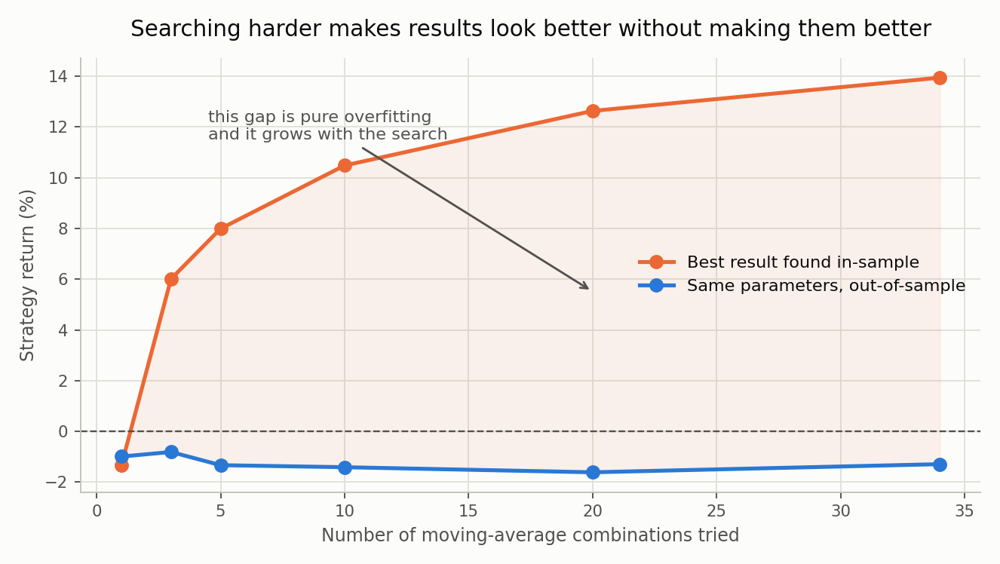

# Signal Parameter Research

The execution study asked *how* to trade. This asks whether the strategy's own
parameters — the 5/20 moving-average windows — were ever worth choosing.

They were picked arbitrarily on day one and never examined.

## Design

Paths are **zero-drift random walks**, so no moving-average rule can have an edge.
Any in-sample profit is therefore 100% noise, and the out-of-sample decay measures
overfitting exactly rather than approximately.

34 window pairs · 600 days per path · 300 train / 300 test · 200 paths.

## Result

```
BEST params, in-sample         +11.37%   median  +8.64%   95% CI [+9.30, +13.44]
SAME params, out-of-sample      -1.55%   median  -4.88%   95% CI [-4.02, +0.91]
default 5/20, out-of-sample     -1.01%   median  -4.08%
searched minus default          -0.54%   95% CI [-2.09, +1.01]   -> no effect
```

Searching produced ~13 percentage points of profit that does not exist.

## The mechanism scales with effort



```
combos tried   best in-sample   same, out-of-sample
           1           -1.34%                -0.99%
           5           +7.99%                -1.33%
          34          +13.94%                -1.29%
```

Out-of-sample is flat. Nothing about the market changed — only how hard we looked.

**Rank correlation between in-sample and out-of-sample ranking: +0.003**
[95% CI −0.056, +0.063]. The in-sample ranking carries no information.

## Control (`control_test.py`)

A null result is worthless if the test is blind, so a real edge was planted by
giving returns genuine momentum. At ρ = 0.20 the out-of-sample return becomes
significantly positive — the test finds what is there.

**Unexpected:** the rank correlation stays ≈0.03 *even with a real edge present*.
The edge belongs to the strategy **family**, not to any window pair.

> Establishing that a strategy type works does not license fine-tuning its
> parameters. Those are two separate claims, and the second needs far more evidence.

## Two ways to pick a winner (`picking_one_winner.py`)

- **Per path** — answers *"does searching work?"* (what this study did)
- **Pooled across paths** — answers *"which parameter should I use?"*

They are different questions needing different methods. Pooled selection beats
per-path selection even when a real edge exists (+11.0% vs +8.2% out of sample),
because per-path fitting absorbs each path's noise.

## Files
| file | what it does |
|---|---|
| `signal_params.py` | the main 34-combo search, 200 paths |
| `fixed_warmup.py` | corrected version (see the warm-up bug below) |
| `overfit_scaling.py` | how the illusion grows with search size |
| `control_test.py` | plants a real edge to prove the test isn't blind |
| `picking_one_winner.py` | per-path vs pooled selection |

## A bug found in this study

The first version sliced the price series *then* computed moving averages on each
half, restarting the warm-up. A 100-day slow window sat in cash for 99 of the 300
test days. Fixing it (`fixed_warmup.py`) shrank the measured overfitting gap from
15.5 to 12.9 points — about 17% of the headline was an artifact of my own slicing.
