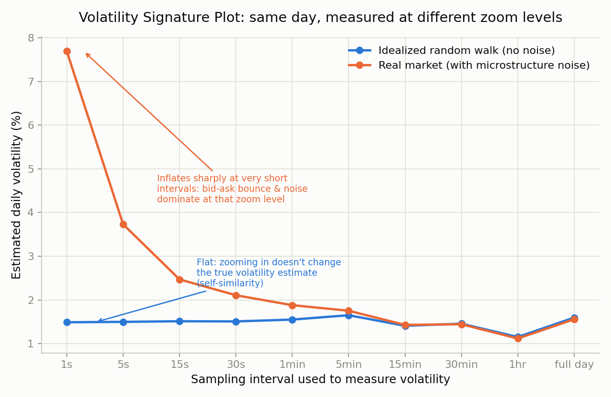

# Brownian Motion & Microstructure Noise

`signature_plot.py` simulates one trading day at one-second resolution and
measures realised volatility at sampling intervals from 1 second to the full day,
twice: once on a clean random walk, once with bid-ask-bounce-style noise added.

- The clean path is **flat** — zooming in doesn't change the volatility estimate.
  That is self-similarity, the defining property of Brownian motion.
- The noisy path **inflates sharply at short intervals**, because at that zoom
  level you are measuring the bid-ask bounce rather than the price process.

This is why realised-volatility estimators sample at 5-minute rather than
1-second intervals, and it is the conceptual bridge to the execution work: at fine
enough resolution, what you are measuring is market structure, not the market.
